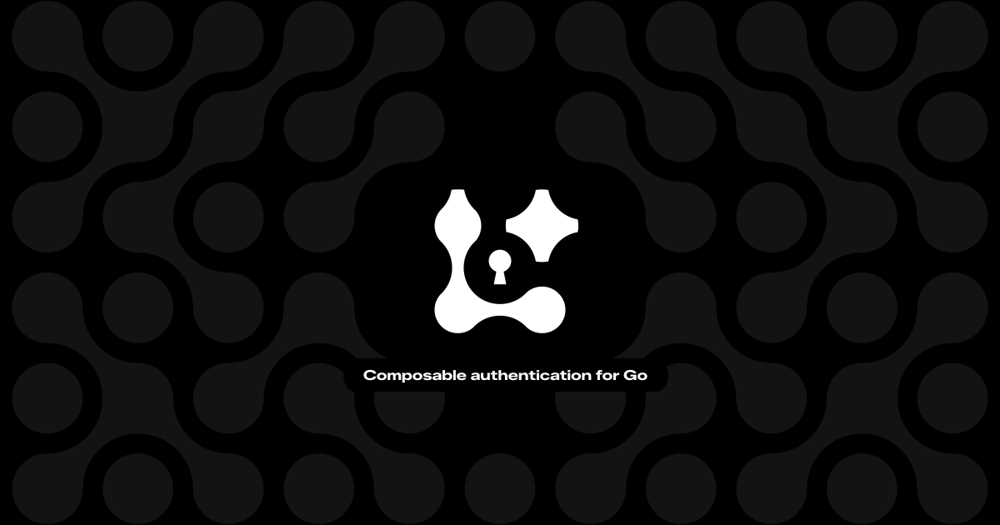

<p align="center">
  <a href="https://limenauth.dev">
    
  </a>
</p>

# limen-auth

Official TypeScript client SDK for **[Limen](https://github.com/thecodearcher/limen)** — a modern, composable authentication library for Go. Framework-agnostic core with first-class **React, Vue, Svelte, and Solid** adapters.

> 📖 Full guides and API reference: **[limenauth.dev](https://limenauth.dev)**

## Install

```bash
npm install limen-auth
```

Works with any framework — or none at all. If you're on React, Vue, Svelte, or Solid, just have that framework installed; there's nothing else to add.

## Quick start

```ts
import { createAuthClient } from "limen-auth";
import { credentialPasswordPlugin } from "limen-auth/plugins/credential";

export const auth = createAuthClient({
  baseURL: "http://localhost:8080", // your Limen server origin
  plugins: [credentialPasswordPlugin()],
});

await auth.signIn.credential({ credential: "ada@example.com", password: "secret" });
const session = await auth.getSession(); // Session | null
await auth.signout();
```

`auth.$session` is a reactive store for the current user. It loads on its own, keeps your open tabs in sync, and updates as you sign in and out — so the UI always reflects the real session.

## Framework adapters

Import `createAuthClient` from your framework's entry point and you get a `useSession()` wired to it:

```tsx
import { createAuthClient } from "limen-auth/react";
import { credentialPasswordPlugin } from "limen-auth/plugins/credential";

export const auth = createAuthClient({ baseURL: "...", plugins: [credentialPasswordPlugin()] });

function Profile() {
  const { data, isPending } = auth.useSession();
  if (isPending) return <p>Loading…</p>;
  return data ? <p>Hi {data.user.email}</p> : <p>Signed out</p>;
}
```

Also available from `limen-auth/vue`, `limen-auth/svelte`, and `limen-auth/solid`.

## Plugins

Add the sign-in flows you need as plugins (each lives under `limen-auth/plugins/<name>`):

- `credentialPasswordPlugin` — email/username + password
- `oauthClientPlugin` — social / OAuth providers
- `magicLinkPlugin` — passwordless email links
- `twoFactorPlugin` — TOTP, OTP, and backup codes
- `bearerPlugin` / `sessionJwtPlugin` — token-based sessions

See the plugin and full API reference at **[limenauth.dev](https://limenauth.dev)**.

## License

MIT © Brian Iyoha
